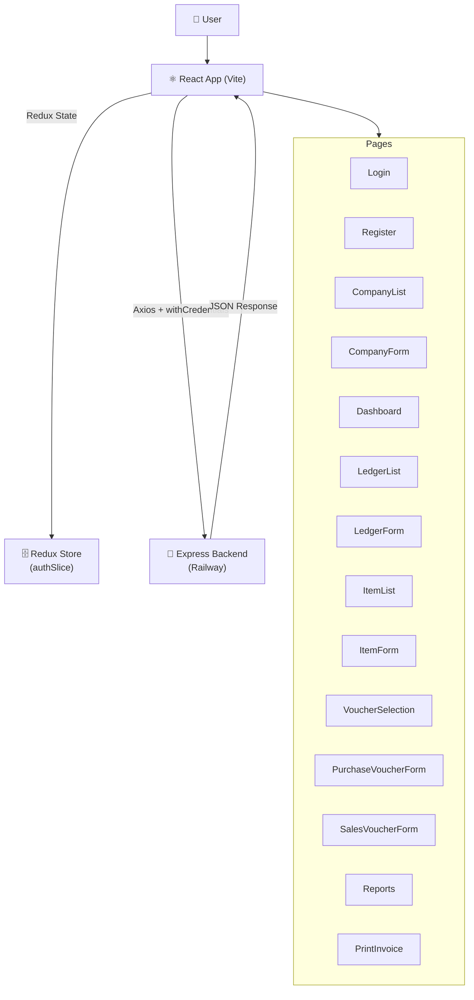

# SmartERP — Frontend

> A keyboard-driven, Tally-inspired React SPA for managing companies, ledgers, inventory, vouchers, and financial reports.


---

## ✨ Features

- 🔑 **Authentication flow** — Register, login, and logout with JWT cookie-based sessions
- 🏢 **Company management** — Create, edit, and switch between multiple companies
- 📒 **Ledger management** — Manage customer and supplier accounts with opening balances
- 📦 **Inventory management** — Full CRUD for stock items with SKU, GST rate, and quantity tracking
- 🧾 **Purchase & Sales vouchers** — Multi-line voucher entry forms with auto stock updates
- 🖨️ **Print-ready invoices** — Formatted invoice view with browser print support via `react-to-print`
- 📊 **Dashboard** — Real-time KPI cards showing sales, purchases, and outstanding balances
- 📑 **Reports** — Five dedicated report views: customers outstanding, suppliers outstanding, stock summary, sales register, purchase register
- ⌨️ **Keyboard-first UX** — Custom `useShortcuts` and `useFormNavigation` hooks for Tally-style keyboard navigation
- 🔔 **Toast notifications** — Glassmorphic dark-mode toasts via `react-toastify`
- 🛡️ **Protected routing** — Redux-powered `isAuthenticated` guard on all app routes

---

## 🏗️ Architecture



---

## 📁 Project Structure

```
frontend/
├── index.html                    # Vite HTML entry point
├── vite.config.js                # Vite + React + TailwindCSS plugin config
├── vercel.json                   # Vercel SPA rewrite rule (/* → /index.html)
├── eslint.config.js
├── package.json
│
└── src/
    ├── main.jsx                  # ReactDOM.createRoot, Redux Provider, BrowserRouter
    ├── App.jsx                   # Route definitions + ProtectedRoute guard
    ├── index.css                 # Global styles and Tailwind base
    │
    ├── https/
    │   └── axios.js              # Axios instance (baseURL from VITE_API_URL, withCredentials)
    │
    ├── redux/
    │   ├── store.js              # Redux store configuration
    │   └── slices/
    │       └── authSlice.js      # Auth state (isAuthenticated, user)
    │
    ├── hooks/
    │   ├── useShortcuts.js       # Global keyboard shortcut handler (Tally-style)
    │   └── useFormNavigation.js  # Tab/Enter navigation between form fields
    │
    ├── context/                  # (Reserved for future React context providers)
    │
    ├── components/
    │   ├── layout/               # MainLayout (sidebar + outlet wrapper)
    │   ├── dashboard/            # Dashboard metric cards
    │   ├── company/              # Company display components
    │   ├── comapnyForm/          # Company form components
    │   ├── ledgerForm/           # Ledger form components
    │   ├── ledgerList/           # Ledger list components
    │   ├── itemForm/             # Stock item form components
    │   ├── itemList/             # Stock item list components
    │   ├── purchaseVoucherForm/  # Purchase voucher form components
    │   ├── salesVoucherForm/     # Sales voucher form components
    │   ├── voucherSelection/     # Voucher type selector
    │   ├── reports/              # Report viewer components
    │   ├── printInvoice/         # Printable invoice components
    │   ├── login/                # Login form components
    │   └── register/             # Register form components
    │
    ├── pages/
    │   ├── Login.jsx
    │   ├── Register.jsx
    │   ├── Dashboard.jsx
    │   ├── CompanyList.jsx
    │   ├── CompanyForm.jsx
    │   ├── LedgerList.jsx
    │   ├── LedgerForm.jsx
    │   ├── ItemList.jsx
    │   ├── ItemForm.jsx
    │   ├── VoucherSelection.jsx
    │   ├── PurchaseVoucherForm.jsx
    │   ├── SalesVoucherForm.jsx
    │   ├── Reports.jsx
    │   └── PrintInvoice.jsx
    │
    └── assets/                   # Static assets (images, icons)
```

---

## ⚡ Quick Start

### Prerequisites

| Tool | Version |
|------|---------|
| Node.js | >= 18.x |
| npm | >= 9.x |

### Installation

1. **Clone and navigate to the frontend folder:**
   ```bash
   git clone <repo-url>
   cd frontend
   ```

2. **Install dependencies:**
   ```bash
   npm install
   ```

3. **Configure environment variables:**
   ```bash
   # Create a .env file at the frontend root
   VITE_API_URL=http://localhost:3000
   ```

4. **Start the development server:**
   ```bash
   npm run dev
   ```
   The app will be available at `http://localhost:5173`.

5. **Build for production:**
   ```bash
   npm run build
   ```

6. **Preview the production build locally:**
   ```bash
   npm run preview
   ```

7. **Run ESLint:**
   ```bash
   npm run lint
   ```

### Environment Variables

| Variable | Description | Example |
|----------|-------------|---------|
| `VITE_API_URL` | Base URL of the SmartERP backend API | `https://smarterp-backend-production-6f3c.up.railway.app` |

---

## 🗺️ Application Routes

| Path | Page | Protected |
|------|------|:---------:|
| `/login` | Login | No |
| `/register` | Register | No |
| `/companies` | Company List | Yes |
| `/company/create` | Create Company | Yes |
| `/company/edit/:id` | Edit Company | Yes |
| `/dashboard` | Dashboard | Yes |
| `/ledgers` | Ledger List | Yes |
| `/ledgers/create` | Create Ledger | Yes |
| `/ledgers/edit/:id` | Edit Ledger | Yes |
| `/inventory` | Stock Item List | Yes |
| `/inventory/create` | Create Stock Item | Yes |
| `/inventory/edit/:id` | Edit Stock Item | Yes |
| `/vouchers` | Voucher Type Selection | Yes |
| `/vouchers/purchase` | Purchase Voucher Form | Yes |
| `/vouchers/sales` | Sales Voucher Form | Yes |
| `/vouchers/sales/print/:id` | Print Sales Invoice | Yes |
| `/reports` | Reports Dashboard | Yes |

---

## 🔑 State Management

The app uses **Redux Toolkit** with a single `authSlice`:

- **`isAuthenticated`** — controls the `ProtectedRoute` guard; if `false`, the user is redirected to `/login`
- **`user`** — stores the logged-in user's details

All API calls use the shared **Axios instance** in `src/https/axios.js`, which is pre-configured with `withCredentials: true` so the JWT cookie is automatically sent on every request.

---

## ⌨️ Keyboard Navigation

The app includes two custom hooks for Tally-style keyboard-first UX:

| Hook | Purpose |
|------|---------|
| `useShortcuts.js` | Global keyboard shortcuts (e.g., hotkeys to open ledgers, vouchers, reports) |
| `useFormNavigation.js` | Tab/Enter key navigation between form fields within voucher and master forms |

---

## 🚀 Deployment

The frontend is deployed on **Vercel**.

### Vercel Deployment Steps

1. Push your code to GitHub and import the repository in the Vercel dashboard.
2. Set the **Root Directory** to `frontend`.
3. Add the environment variable:
   - `VITE_API_URL` — your Railway backend URL (e.g., `https://smarterp-backend-production-6f3c.up.railway.app`)
4. Vercel will automatically run `npm run build` on each push.
5. The `vercel.json` rewrite rule (`/* → /index.html`) ensures client-side routing works correctly.

---

## 🤝 Contributing

1. **Fork** the repository
2. **Create a feature branch:** `git checkout -b feature/your-feature-name`
3. **Commit your changes:** `git commit -m "feat: add your feature"`
4. **Push to your branch:** `git push origin feature/your-feature-name`
5. **Open a Pull Request** and describe your changes

Please run `npm run lint` before submitting and ensure no secrets or `.env` files are committed.

---

## 📄 License

This project is licensed under the **ISC License**.
